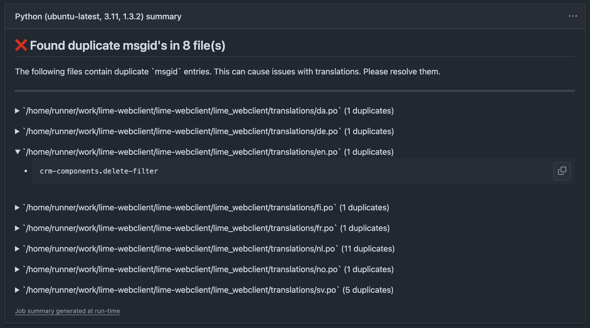

# po-linter

Checks for duplicate `msgid`s in `.po` files to prevent translation issues.

This GitHub Action scans your repository for `.po` files and checks for duplicate `msgid` entries within each file. Duplicate `msgid`s can lead to incorrect or missing translations, so this action helps you catch these issues early.

## Usage

To use this action, add the following step to your workflow file (e.g., `.github/workflows/main.yml`):

```yaml
name: Lint PO Files
on: [push]

jobs:
  lint-po:
    runs-on: ubuntu-latest
    steps:
      - name: Checkout code
        uses: actions/checkout@v4

      - name: Run po-linter
        uses: Lundalogik/po-linter@v1
```

## Inputs

This action does not require any inputs.

## Outputs

This action does not produce any outputs.

## Example output

The action provides a summary of its findings in the GitHub Actions job summary.

### When duplicates are found

If duplicate `msgid`s are found, the action will fail and provide a summary detailing which files contain duplicates and what the duplicate `msgid`s are.



### When no duplicates are found

If no duplicate `msgid`s are found, the action will succeed and provide a confirmation summary.


## License

This project is licensed under the Apache-2.0 License. See the [LICENSE](LICENSE) file for details.
